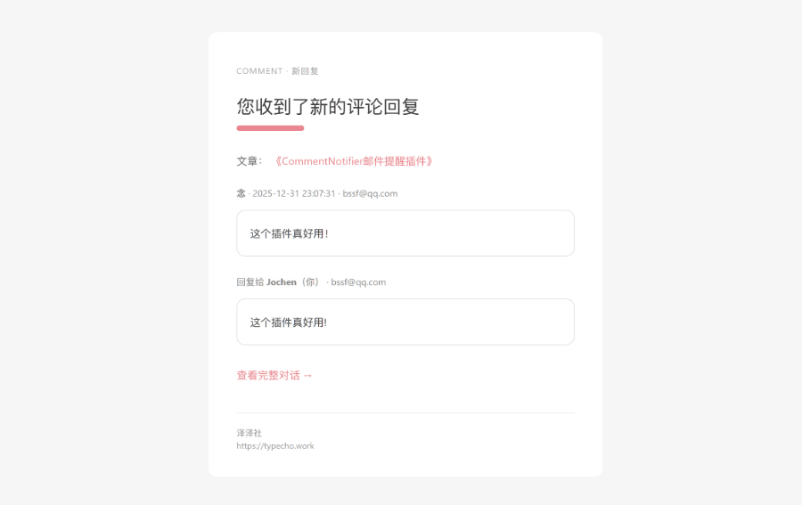

# Comment Mail（评论邮件样式适配）

这是一个 **基于 [CommentNotifier](https://github.com/jrotty/CommentNotifier)** 开发的模板

整体设计采用 **[PureSuck Theme](https://github.com/MoXiaoXi233/PureSuck-theme)** 的整体设计风格，  
不过可在任意主题下使用，看个人喜欢使用即可。

# 食用指南
下载位于 /dist 目录下的压缩包 

将压缩包放到服务器后台 usr/plugins/CommentNotifier/template 后解压，得到文件夹 `PureMail` 

然后在 Typecho后台 在控制台→评论邮件模板里启用即可。

# 预览图

